# TextBar-Recipes

## What?
Recipes for TextBar app [www.richsomerfield.com/apps](http://www.richsomerfield.com/apps).

## Contributions
Please submit pull-requests so that I can add your ideas/scripts.

----

## TextBar License

TextBar requires a license (after the 7 day trial period). But, TextBar Mac licenses work with all versions of TextBar; v1, v2 and v3 - there is **no** upgrade fee for v3.

TextBar repesents a huge amount of work. If you would like to donate that would be very much appreciated.

**Donate:** [paypal.me/richie5um](https://www.paypal.me/richie5um)

----

## Latest Major Features

[Release Notes](http://www.richsomerfield.com/apps/textbar/releasenotes_textbar.html)

----

## New for TextBar v3.2.2

TextBar v3.2 has **major** new features over v3.1. But, as I've only recently released v3 it seems simpler to keep the v3 prefix.

### Show Charts in MenuBar

TextBar has an internal charting format to show charts in your MenuBar.


Example here: [Bitcoin Close Price - USD](https://github.com/richie5um/TextBar-Recipes/blob/master/Items/Bitcoin%20Price%20USD%20(daily%20close).textbar?raw=true)

Example here: [Bitcoin Close Price - GBP](https://github.com/richie5um/TextBar-Recipes/blob/master/Items/Bitcoin%20Price%20GBP%20(daily%20close).textbar?raw=true)
> Note: Requires accessing www.coinbase.com in your Safari web browser to approve access first.

Open the script to see how it works.

More examples here: [TextBar Items](Items)
> Please submit them and I'll include them here :).

### Show HTML in MenuBar

TextBar can show HTML in your menubar - to give you ultimate control / customizability [sic].

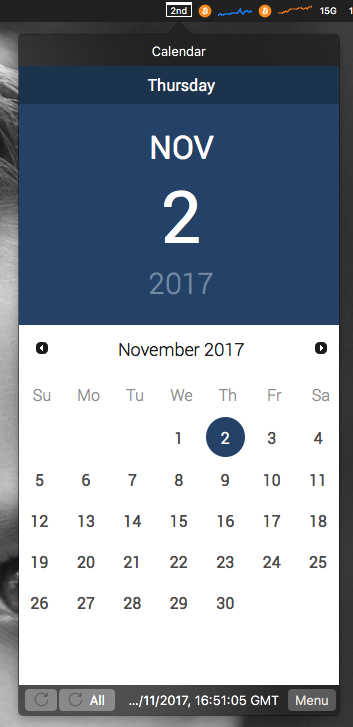

Example here: [Calendar](https://github.com/richie5um/TextBar-Recipes/blob/master/Items/Calendar.textbar?raw=true)

> Note: This example uses HTML for MenuBar and HTML for Popover.

### Added native support for Proxy Configuration in Prefernces > Network

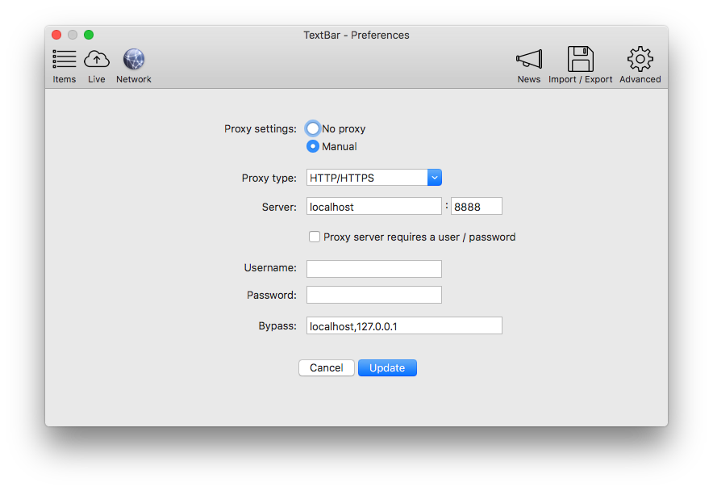

### Improvements to control in Prefernces > Advanced


----

## New for TextBar v3

Here are the major new items for v3...

### New Preferences UI

Complete re-written Preferences UI to make to easier to add and edit TextBar Items.

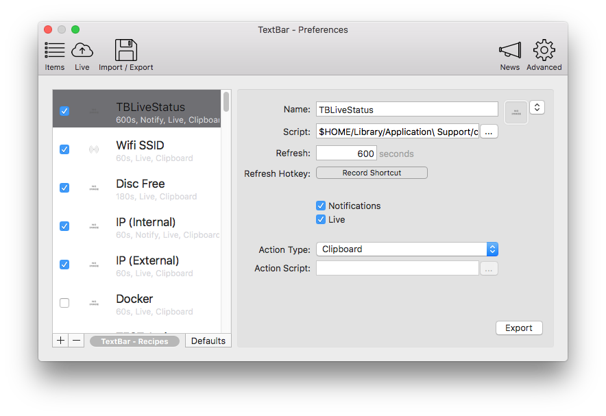

### Share TextBar Items

Use the new _Export_ button to save and share TextBar items with other TextBar users!

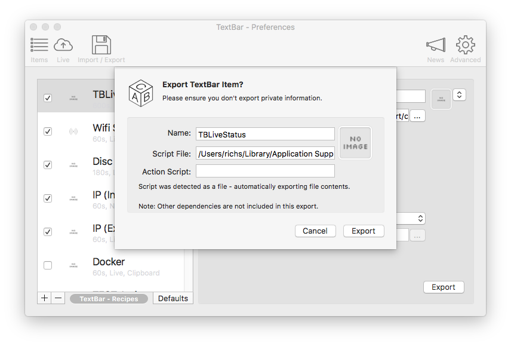

> I'm hoping to create a TextBar Items webpage at some point, for now email them to me or create a PullRequest and I'll add them to this page.

Note: The Export mechanism tries to detect if the script is a file. If it is, it'll automatically include the contents of the file. Otherwise it'll require any used files to be available on the other system. If in doubt, use the new file picker to select a script file - this will work with the new export mechanism.

The old Import/Export mechanism is still available for backups of your configured TextBar Items, but this does not include any file contents. It is intended for personal backups only.

### Shortcut to Refresh

You can now assign a shortcut key to a TextBar Item so you can quick refresh it. You could use use this as a simple script runner :-).

### Drag and Drop Images

Drag and Drop an image file onto the new preferences _image_ area to use your own image for your TextBar item.

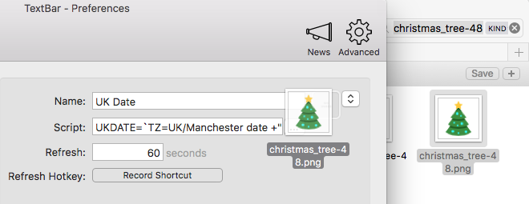

### And numerous other fixes and improvements

----

## New for TextBar v2

Here are the major new items for v2...

### TextBar Live

[https://app.textbar.co](https://app.textbar.co)

> Do you have multiple Mac computers? Do you have remote or headless Mac servers? If so, then TextBar Live could be for you. TextBar Live allows you to see the status of all of your TextBar items, from all of your Macs, in a single place on the web.

**Note:** TextBar Live requires a monthly subscription.

* Register on [https://app.textbar.co](https://app.textbar.co)
* Create a subscription - note: the first 100 users get a free 1 device subscription.

* In TextBar Mac app > Preferences > Live:
    * Set your API Token - from [https://app.textbar.co/#/account](https://app.textbar.co/#/account)
    * And then enable

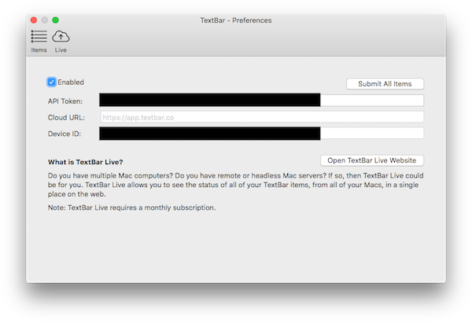

* View your TextBar items on the web:

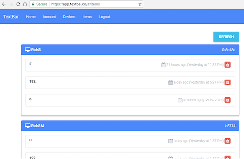

----

## Troubleshooting

If you encounter problems with TextBar, you can enable logging. How to:
* Run 'defaults write com.RichSomerfield.TextBar ScriptLogging -bool true'
* Restart TextBar app
* Open the macOS Console app, and use 'TextBar' filter

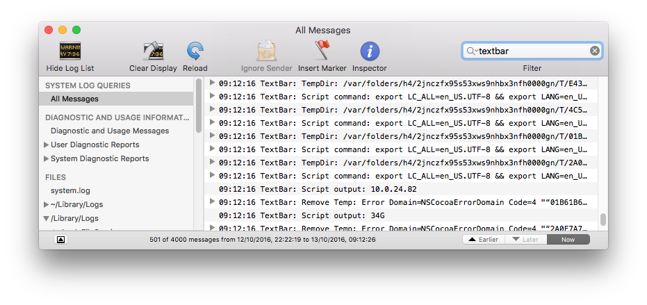

To disable the extended logging:
* Run 'defaults delete com.RichSomerfield.TextBar ScriptLogging'
* Restart TextBar app

----

### Dynamic Values

Some of the TextBar values can be overriden from your script - so you can change them dynamically.

The dynamic section is identified by returning `----TEXTBAR----` in your script.

#### Dynamic Refresh

This script will override the refresh configured for this item (in TextBar preferences) with 5 secs.

    #!/bin/bash
    date
    echo "----TEXTBAR----"
    echo "REFRESH=5"


#### Dynamic Image

This script will override the image configured for this item (in TextBar preferences).

    #!/bin/bash
    echo "Dynamic Image"
    echo "----TEXTBAR----"
    echo "IMAGE=_no_image-32"

The bundled images are stored in `/Applications/TextBar.app/Contents/Resources` (use 'Show Package Contents' to navigate into the app in Finder).

    #!/bin/bash
    echo "Dynamic Image"
    echo "----TEXTBAR----"
    echo "IMAGE=coffee-32"

Prefix the image name with a ':' to load an image from a location on your machine.

    #!/bin/bash
    echo "Dynamic Image"
    echo "----TEXTBAR----"
    echo "IMAGE=:$HOME/Pictures/RichS.jpeg"

#### HTML View

Show HTML in the TextBar view. For example (this is the output of the script):

    Display HTML
    <html>
        <head>
            <style>
                body {
                    font-family: "HelveticaNeue-Light", "Helvetica Neue Light", "Helvetica Neue", Helvetica, Arial, "Lucida Grande", sans-serif;
                    font-weight: 300;
                    background-color: #3B9AD9;
                    color: #ffffff;
                }
            </style>
        </head>
        <body>
            <h1>Hello from TextBar v2</h1>
        </body>
    </html>
    ----TEXTBAR----
    VIEWTYPE=HTML

**Note:** You can also specify the ViewSize of the view.


    Display HTML
    <html>
        ...
    </html>
    ----TEXTBAR----
    REFRESH=10
    VIEWTYPE=HTML
    VIEWSIZE=600,400

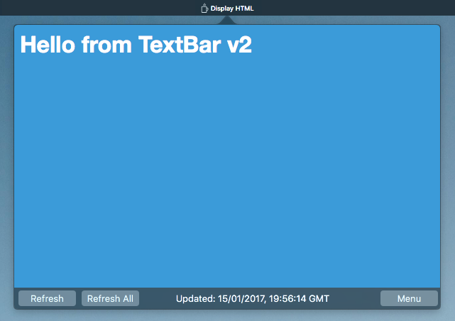

#### URL View

Show a webpage in the TextBar view.

    #!/bin/bash
    echo "Display URL"
    echo "https://www.apple.com"
    echo "----TEXTBAR----"
    echo "VIEWTYPE=URL"
    echo "VIEWSIZE=$(( ( RANDOM % 200 ) + 500 )),$(( ( RANDOM % 200 ) + 300 ))"

**Note:** You can also specify the ViewSize of the view. This script creates a random sized view to demonstrate dynamic refresh too :-).

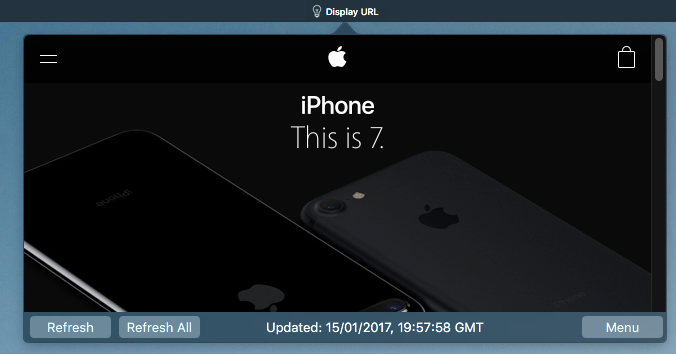

### Last Update
All TextBar items show the last updated time in the menu.

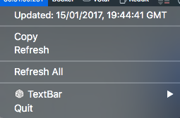

----

## Recipes

### What is my Local IP address?
    ifconfig | grep inet | grep -v inet6 | cut -d" " -f2 | tail -n1

### What is my external IP address?
    curl -s http://ipinfo.io/ip

### What SSID is being used for en0
    $HOME/scripts/ssid.sh

###### [Download Script](Scripts/ssid.sh)


> Requires TextBar 2.0.362 or later.
> This is much better than the SSID command that comes by default in TextBar.

### What is my (approximate) location?
    curl -s http://freegeoip.net/csv/ | awk -F',' '{print $6}'

### What is my latency to Google's DNS Servers?
    ping -c 1 8.8.8.8 | awk -F" |=" '/time/{print $10"ms"}'

### Display Ping Time to a Specified Server
    $HOME/scripts/pingTime.sh google.com
> Download pingTime.sh to your machine (to ~/scripts), and then add this to TextBar.

### How much disk space am I using?
    df / | awk '{ print $5 }' | tail -n 1

### What is the time in a different country (e.g. UK)?
    UKDATE=\`TZ=GB date +"%H:%M %p"\` ; echo "UK: $UKDATE"

### Is my website running?
    ALIVE=\`curl -Is www.google.com | grep -q "200 OK"\` && echo "Google Alive" || echo "Google Dead"

### Site Status - determine if multiple websites are running
	$HOME/scripts/SiteStatus.sh
> Download SiteStatus.sh to your machine (to ~/scripts), and then add this to TextBar.	Read the script as you need to create a directory and file to list websites.
> ###### [Download Script](Scripts/SiteStatus.sh)


### Smiley
    echo '😀'
> Easiest way to see other emoji is; Open TextEdit, then "Edit > Emoji & Symbols". Then just copy and paste into TextBar.

### Colored text
    if [ $((`date +"%S"`%2)) -eq 0 ]; then echo "\e[41mHot donuts now"; else echo "\e[42mHot donuts now"; fi
> [MPU 321 - 58mins](https://www.relay.fm/mpu/321)

> Set the refresh to 1 secs for flashing text.


### What is my battery charge?
    ioreg -n AppleSmartBattery -r | awk '$1~/Capacity/{c[$1]=$3} END{OFMT="%.2f%%"; max=c["\"MaxCapacity\""]; print (max>0? 100*c["\"CurrentCapacity\""]/max: "?")}'

### Show CPU 'graph'
    $HOME/scripts/CPUSpeed.sh

###### [Download Script](Scripts/CPUSpeed.sh)

> Download CPUSpeed.sh to your machine (to ~/scripts), and then add this to TextBar.
> Note: This is fairly basic. It is very slow to use ```top``` to calculate the CPU, but, I've not come across a better way yet.


### Show CPU 'graph' - version 2
    $HOME/scripts/cpubar.sh

###### [Download Script](Scripts/cpubar.sh)

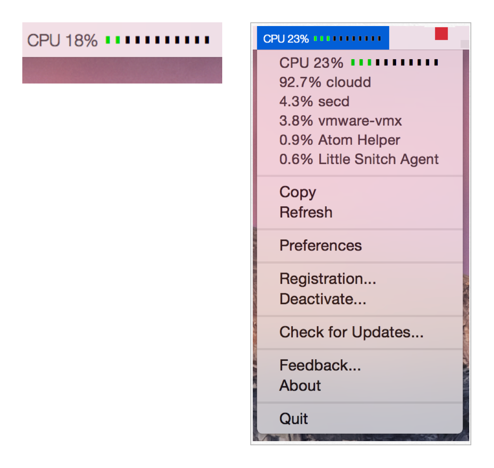
> Download cpubar.sh to your machine (to ~/scripts), and then add this to TextBar.
> Requires TextBar 1.5.174 or later.

### Show Mem 'graph'
    $HOME/scripts/membar.sh

###### [Download Script](Scripts/membar.sh)

> Download membar.sh to your machine (to ~/scripts), and then add this to TextBar.
> Requires TextBar 1.5.174 or later.

### What song (and artist) is playing in iTunes?
    osascript -e 'if application "iTunes" is running then' -e 'tell application "iTunes"' -e 'if player state = playing then' -e '(get name of current track) & " – " & (get artist of current track)' -e 'else' -e 'return ""' -e 'end if' -e 'end tell' -e 'else' -e 'return ""' -e 'end if'
> If iTunes is running and a song is playing, this will display the current song name and artist name.

### What song (and artist) is playing in Spotify?
    osascript -e 'if application "Spotify" is running then' -e 'tell application "Spotify"' -e 'if player state is playing then' -e 'return "♫ " & (artist of current track as string) & " - " & (name of current track as string)' -e 'end if' -e 'end tell' -e 'end if'
> If Spotify is running and a song is playing, this will display the current song name and artist name.

### Weather
    curl -s 'http://api.openweathermap.org/data/2.5/weather?q=Manchester,UK&units=metric' | python -c 'import sys, json; data=json.load(sys.stdin); print("{} : {:.1f}°C".format(data["weather"][0]["main"], data["main"]["temp"]))'


> Don't refresh too frequently as this service is rate limited.
> You'll need to change "Manchester,UK" to your location, unless you actually live in Manchester :-).
> Note: An API key is required.

### Unicode Weather
    curl weather.mar.cx/Manchester,_UK | grep "<title>" | cut -d'>' -f2 | cut -d' ' -f1
> This is likely to break as it isn't entirely robust. Edit the location to get your weather.

### Show (Local) Git Repo Status
    $HOME/scripts/git_status.sh TextBar "$HOME/Code/TextBar"

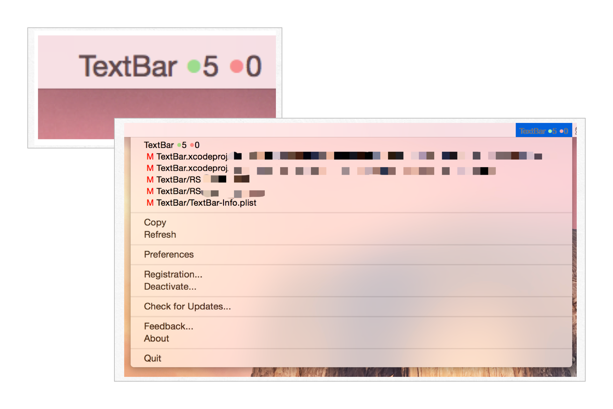
> Download git_status.sh to your machine (to ~/scripts), and then add this to TextBar.
> Requires TextBar 1.5.174 or later

### Get Current ControlPlan context
    osascript -e 'tell application "ControlPlane" to get the current context' | sed -e 's: + ::g'


> I also remove the + between the contexts to save space (TextBar green, ControlPlane red).

### Unread Emails in AppleMail
    if [[ $(pgrep Mail) ]]; then osascript -e 'tell application "Mail" to get the unread count of inbox'; else echo "N/A"; fi

### Unread Emails in Outlook
    osascript $HOME/scripts/CheckOutlookMail.scpt

###### [Download Script](Scripts/CheckOutlookMail.scpt)

> Download CheckOutlookMail.scpt to your machine (to ~/scripts), and then add this to TextBar.

### Date of Latest Email in AppleMail
    osascript $HOME/scripts/LatestEmail.scpt

###### [Download Script](Scripts/LatestEmail.scpt)

> Download LatestEmail.scpt to your machine (to ~/scripts), and then add this to TextBar.


### Next Meeting in Outlook
    osascript $HOME/scripts/OutlookNextMeeting.scpt

###### [Download Script](Scripts/OutlookNextMeeting.scpt)

> Download OutlookNextMeeting.scpt to your machine (to ~/scripts), and then add this to TextBar.
> Edit OutlookNextMeeting.scpt if you want the text formatted differently.
> Note: This only looks 60 mins into the future. You can edit OutlookNextMeeting.scpt if you want longer.

### Show the clipboard (text)
    pbpaste | sed 's/^[[:space:]]*//;s/[[:space:]]$//' | sed -E 's/^(.{10}).+$/\1.../'
> This looks more complex than you might imagine. It; strips leading and trailing whitespace, displays only 10 chars (and if it exceeds 10 characters, it'll display the ellipsis).
> Obviously, if you 'Copy to Clipboard' on this, you'll get the truncated text - but, as it is already on the clipboard, you don't need to copy it :-).

### Character Count of current clipboard
    pbpaste | wc -c

### Mouse and Keyboard Battery Status
    echo "M: "`ioreg -c BNBMouseDevice | grep '"BatteryPercent" ='  |  sed 's/[^0-9]*//g'`"%"
    echo "B:" `ioreg -c AppleBluetoothHIDKeyboard | grep '"BatteryPercent" ='  | sed 's/[^0-9]*//g'`"%"

> Note: For Magic Mouse 2, you may need to use this instead (change 'Magic Mouse 2' if you've renamed your device):
	echo "M: "`ioreg -l | grep -A 10 "Magic Mouse 2" | grep '"BatteryPercent" =' | sed 's/[^0-9]*//g'`"%"


> Add these as two separate items.

### WhatPulse keys press

[WhatPulse](http://whatpulse.org/) is a keyboard and mouse statistics generater.

Keys pressed in the last hour:

    printf "%'.0f\n" $(echo '' | sqlite3 ~/Library/Application\ Support/whatpulse/whatpulse.db -cmd "select count from keypresses where day = DATE('now') and hour = strftime('%H',TIME('now','localtime'));" -batch)

Key pressed today:

    printf "%'.0f\n" $(echo '' | sqlite3 ~/Library/Application\ Support/whatpulse/whatpulse.db -cmd "select sum("count") from keypresses where day = date();" -batch)

### Stackoverflow Reputation
    json=$(curl -s http://stackoverflow.com/users/flair/22656.json) && echo $json | sed 's/,//g;s/^.*reputation...\([0-9]*\).*$/\1/'
> (replace 22656 by your SO account number)

### VirtualBox
    $HOME/scripts/vbox.sh

###### [Download Script](Scripts/vbox.sh)

> Download vbox.sh to your machine (to ~/scripts), and then add this to TextBar.
> Also, download vbox_run.sh to your machine (to ~/scripts) and add the action for this item to be $HOME/scripts/vbox_run.sh. Then, when you click on the machine, it'll start it.
> Many thanks to SteffenK!

### Vagrant
    VBoxManage list runningvms | egrep -oh '[a-z]+_default' | awk -F'_' '{print $1}' | paste -s -d", " -
> Show all currently running vagrant boxes (VirtualBox only)

### Show Selected File in Finder
    osascript $HOME/scripts/SelectedFinderFile.scpt

###### [Download Script](Scripts/SelectedFinderFile.scpt)

> Download SelectedFinderFile.scpt to your machine (to ~/scripts), and then add this to TextBar.

### Show Outdated Formulae in Homebrew
    /usr/local/bin/brew update >/dev/null && /usr/local/bin/brew outdated | wc -l | awk '{print $1}' ; /usr/local/bin/brew outdated
> This will show the number of outdated formulae in the menubar; clicking the item will show the list of items that are outdated. Update the path to `brew` to match your system.

### Remind me to sit/stand
    test -f $HOME/tmp/stand && { echo "Stand" && rm $HOME/tmp/stand } || { echo "Sit" && touch $HOME/tmp/stand }
> Configure with whatever refresh frequency you want - in TextBar Preferences.

## ANSI Escape Colors
    echo 'Normal \e[41m Other '
> This is an example.
> Requires TextBar 1.5.174 or later

## Multi-line Scripts
    echo 'Hello' ; echo 'World' ; echo '!'
> Requires TextBar 1.5.174 or later

## HTML
From v1.3.3, TextBar can render _basic_ HTML into your TextBar item. The text must begin with ```<html>```, or end with ```</html>``` - must be in lowercase! - for it to be renderred as HTML.

The HTML support is fairly limited, it supports text and images. The text can be styled using embedded CSS, the images can't. Images should be resized to about 14x14.

### Hello World
    echo '<html><b>Hel</b>lo <i>wor</i>ld</html>'

### Display Image
    echo '<html></html>'
> You can't resize the image, so make sure it is 14x14 pixels for it to show correctly.

### CSS Styled Text
    cat '$HOME/scripts/apple.html'

> Download apple.html to your machine (to ~/scripts), and then add this to TextBar.

### Is my External drive mounted (with HTML Styled Text)?
    [ -d /Volumes/MyExtDrive ] && echo "<html><font face=\"helveticaneue-thin\"> MyExtDrive mounted</font></html>" || echo "<html><font face=\"helveticaneue-thin\">MyExtDrive <font color=red><b>not</b></font> mounted</font></html>"

### Show last 10 (ish) files backed-up by CrashPlan
    $HOME/scripts/CrashPlan.sh

###### [Download Script](Scripts/CrashPlan.sh)

> Download CrashPlan.sh to your machine (to ~/scripts), and then add this to TextBar.

### Show macOS Desktop Space Number
    $HOME/scripts/SpaceNumber.sh

###### [Download Script](Scripts/SpaceNumber.sh)

> Requires you to name your wallpapers for each space - see notes in the script for more details. Download SpaceNumber.sh to your machine (to ~/scripts). and then add this to TextBar.


## Preferences
> Requires TextBar v1.4.9 (or later)

I'm working on a UI screen for preferences, but, until then you can set the Default Font/Font-Size, and Shell using ```defaults write```

### How to set the default Font
    defaults write com.RichSomerfield.TextBar DefaultFontName -string "HelveticaNeue-UltraLight"
> Requires a restart of the TextBar app

### How to set the default Font-Size
    defaults write com.RichSomerfield.TextBar DefaultFontSize -int 10
> Requires a restart of the TextBar app

### How to set the default Shell
    defaults write com.RichSomerfield.TextBar DefaultShell -string "/bin/sh"
> Requires a restart of the TextBar app

### How to set the default Max Width of textbar items
    defaults write com.RichSomerfield.TextBar DefaultMaxWidth -int 100
> Requires TextBar v1.4.47 (or later)

> Requires a restart of the TextBar app

> Note: This is in points. Use '0' for unlimited.

> Note: This only works on OS X Yosemite (10.10)

### How to enable more default images
    defaults write com.RichSomerfield.TextBar DefaultAllImages -bool YES

> Requires a restart of the TextBar app to read the folder

### How to use your own images
    defaults write com.RichSomerfield.TextBar DefaultAdditionalImagesFolder -string "/Users/rich/images/png"
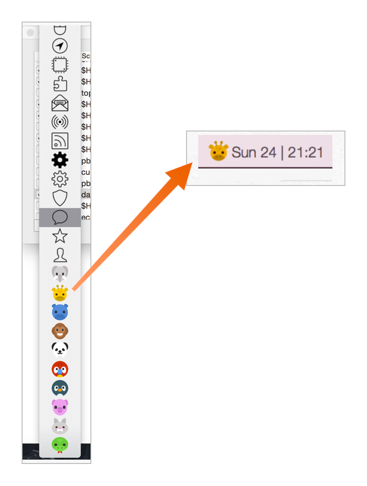
> Requires TextBar v1.6.1 (or later)

> Requires a restart of the TextBar app to read the folder

> Note: Only loads 'png' files

> Note: This will be moving to a new preferences UI when I get time to implement it

To remove use:

    defaults delete com.RichSomerfield.TextBar DefaultAdditionalImagesFolder

### How to set the default TextBar image size
    defaults write com.RichSomerfield.TextBar DefaultImageSize -int 18
> Requires TextBar v1.6.19 (or later)

> Requires a restart of the TextBar app

### How to set the default TextBar preferences image size
    defaults write com.RichSomerfield.TextBar DefaultMenuImageSize -int 18
> Requires TextBar v1.6.19 (or later)

> Requires a restart of the TextBar app

### How to set the default TextBar notification image size
    defaults write com.RichSomerfield.TextBar DefaultNotificationImageSize -int 18
> Requires TextBar v1.6.19 (or later)

> Requires a restart of the TextBar app

## Actions
Since v1.7.15, TextBar support custom actions. TextBar has, when you click on the text in the menubar, added the text to the clipboard. Now you can customize that behaviour to perform your own actions. Effectively you can build your own menu bar apps (i.e. app launcher, fav folder launcher, ...).

### How To
* Go to TextBar -> Preferences
* Change the Action to 'Script'
* Add your script

### Details
When your script runs, TextBar will pass two environment variables into the shell. These provide you with the index (i.e. position from 0...end in the menu list), and the actual text.

The two environment variables are:

* TEXTBAR_INDEX
* TEXTBAR_TEXT

### Basic Example
* Add an action script of "echo $TEXTBAR_INDEX $TEXTBAR_TEXT > $HOME/output.txt"

When you trigger this action, it'll send the index and text to the output.txt file.

### Spotify Example
* Download the following files:
    * ShowSpotify.scpt
    * SpotifyControl.scpt
* Copy them to your ~/scripts folder
* Configure a Textbar item to have a script of:
    * osascript $HOME/scripts/ShowSpotify.scpt
* Configure the Textbar item to have an action script of:
    * osascript $HOME/scripts/SpotifyControl.scpt

You should now be able to skip tracks and play/pause from the Textbar item.

### Quick Finder Launcher Example
* Create a new TextBar item with an image
* Configure your script to be:
    * echo "\nOpen"
* Configure your action script to be:
    * osascript -e 'tell application "Finder" to make new Finder window'

This'll only show the image in the menubar, but the 'Open' action will be shown in the menu.
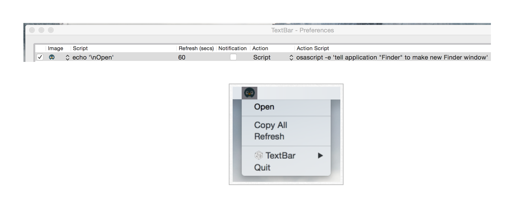

If you want to have more launcher items, then you'll need to create the action script to check for the TEXTBAR_INDEX environment variable value in your action script.

### iCloud Tabs
* Download the following files:
    * icloudtabs.scpt
    * icloudtabsaction.scpt
* Copy them to your ~/scripts folder
* Create a new TextBar item
* Configure a Textbar item to have a script of:
    * echo 'Tabs' && python ~/scripts/icloudtabs.py
* Configure the Textbar item to have an action script of:
    * python ~/scripts/icloudtabsaction.py

This'll show your iCloud tabs from your other devices - it omits the tabs from the local machine.
